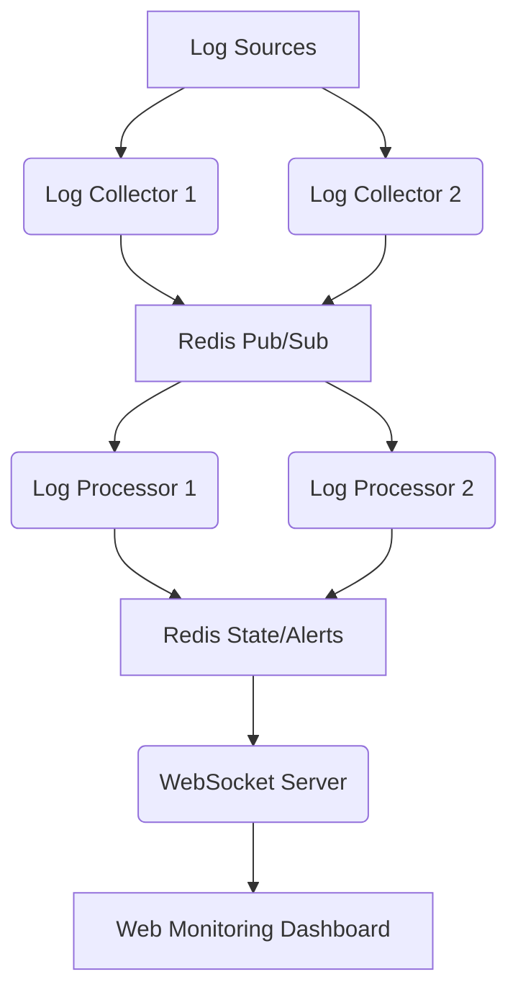

# SentinelLog: 分布式日志监控与告警系统

## 简介

SentinelLog 是一个高性能、分布式的日志监控与告警系统，专为处理大规模日志流设计。它利用异步 I/O 技术实现高效的日志采集和处理，并通过 Redis 作为消息队列 and 状态存储，支持灵活的分布式部署。系统集成了实时 Web 监控面板，能够通过 WebSocket 即时推送异常告警，帮助用户快速发现并响应系统问题。

## 核心特性

*   **高性能日志采集**：基于 Python 的 `asyncio` 异步框架，实现非阻塞的日志文件读取和处理，有效应对高并发日志写入场景。
*   **分布式架构**：利用 Redis 的发布/订阅（Pub/Sub）机制作为日志消息总线，支持多节点日志采集器和处理器协同工作，易于水平扩展。
*   **实时告警**：通过 WebSocket 技术，将实时监控数据和告警信息推送到前端 Web 界面，确保用户第一时间获取异常通知。
*   **灵活的规则引擎**：支持基于正则表达式（Regex）和阈值（Threshold）的自定义告警规则，用户可以根据业务需求灵活配置。
*   **可视化监控面板**：提供直观的 Web 用户界面，展示日志统计、异常趋势和实时告警列表。
*   **轻量级部署**：核心组件采用 Python 和 Redis，部署简单，资源占用低。

## 技术栈

*   **后端**：Python 3.9+ (asyncio, websockets, redis-py)
*   **消息队列/缓存**：Redis
*   **前端**：HTML, CSS, JavaScript (WebSocket API, Chart.js)

## 架构概览



## 快速开始

### 1. 环境准备

确保您的系统已安装 Python 3.9+ 和 Docker（推荐用于 Redis 部署）。

```bash
# 安装 Python 依赖
pip install -r requirements.txt

# 启动 Redis (使用 Docker)
docker run --name sentinel-redis -p 6379:6379 -d redis
```

### 2. 配置

编辑 `config.py` 文件，配置日志文件路径、Redis 连接信息和告警规则。

```python
# config.py 示例
LOG_FILE_PATH = '/var/log/syslog' # 您的日志文件路径
REDIS_HOST = 'localhost'
REDIS_PORT = 6379
REDIS_CHANNEL = 'log_stream'

ALERT_RULES = [
    {
        'name': 'Error Log Alert',
        'pattern': r'ERROR|FATAL',
        'threshold': 5, # 在 60 秒内出现 5 次匹配则告警
        'time_window': 60
    },
    {
        'name': 'Authentication Failure',
        'pattern': r'authentication failure',
        'threshold': 3,
        'time_window': 30
    }
]
```

### 3. 运行组件

**启动日志采集器 (Log Collector)**

```bash
python collector.py
```

**启动日志处理器 (Log Processor)**

```bash
python processor.py
```

**启动 WebSocket 服务器和 Web 界面**

```bash
python web_server.py
```

然后通过浏览器访问 `http://localhost:8080` 查看监控面板。

## 贡献

欢迎提交 Pull Request 或报告 Bug。请确保您的代码符合 PEP 8 规范，并包含相应的测试。

## 许可证

本项目采用 MIT 许可证。详情请参阅 `LICENSE` 文件。
